# 🔐 Smart AIoT Access Control Kiosk

> **Final Project** — Computer Engineering, Ho Chi Minh City University of Technology and Education (HCMUTE), 2026

A multi-factor, liveness-aware access control system combining **AI face recognition** and **RFID card authentication**, built on a local-first architecture with no cloud dependency for real-time decisions.

**Author:** Dinh Xuan Kinh · MSSV 23119159 · [GitHub](https://github.com/xuankinh)

---

## Table of Contents

- [System Architecture](#system-architecture)
- [Hardware](#hardware)
- [Authentication Pipeline](#authentication-pipeline-5-steps)
- [Demo Results](#demo-results)
  - [Step-by-step Pipeline](#1-step-by-step-pipeline)
  - [Face Recognition — Success](#2-face-recognition--success)
  - [RFID Card — Success](#3-rfid-card--success)
  - [Security — Rejected Cases](#4-security--rejected-cases)
  - [Web Admin Interface](#5-web-admin-interface)
  - [ESP32 Serial Telemetry](#6-esp32-serial-telemetry)
- [Performance Metrics](#performance-metrics)
- [Setup](#setup)
- [Project Structure](#project-structure)
- [Limitations](#limitations)

---

## System Architecture

```
Web Admin (Browser)
      │  Firebase REST (admin commands)
      ▼
Firebase RTDB  ◄──────────────────────────────────┐
      │  Poll 0.5s                                 │ Log DailyLogs / AIEvents
      ▼                                            │
Python AI Engine (main.py)  ──── HTTP POST ──►  ESP32-S3 (Port 80)
   MediaPipe · ONNX · InsightFace                RFID · Servo · LCD · I2S
```

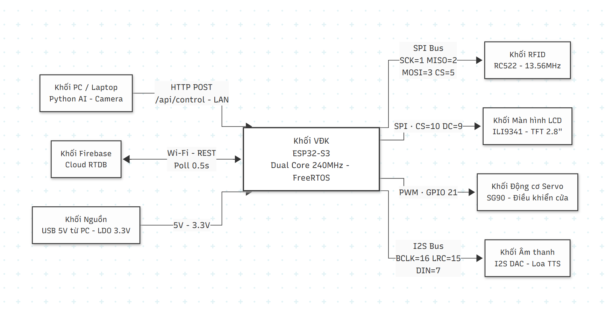

| Component | Role |
|-----------|------|
| **ESP32-S3** | RFID scanning, servo door control, LCD display, TTS audio, HTTP server |
| **Python AI** | Camera pipeline, anti-spoofing, face recognition, Firebase bridge |
| **Firebase RTDB** | Command relay (Web → Python/ESP32), attendance log, admin management |
| **Web Admin** | Register students, manage profiles, view attendance history |

**Design principle:** All real-time decisions (face recognition, RFID lookup, door control) happen **locally on LAN** — Firebase is only used for logging and Web Admin commands. This keeps door response latency under 200 ms regardless of Internet quality.

---

## Hardware

| Component | Spec | GPIO |
|-----------|------|------|
| ESP32-S3 DevKitC-1 N16R8 | Xtensa LX7 240MHz, 16MB Flash, 8MB PSRAM | — |
| RFID RC522 | 13.56MHz, ISO 14443A | SCK=1 MISO=2 MOSI=3 CS=5 RST=4 |
| LCD ILI9341 | TFT 2.8" 320×240 | CS=10 DC=9 RST=8 |
| Servo SG90 | PWM 50Hz, 0°/90° | GPIO 21 |
| I2S Audio | DAC + Speaker, Google TTS | BCLK=16 LRC=15 DIN=7 |
| Webcam USB | 640×480 @ 30fps | — (Python side) |

> **Note:** GPIO 26–32 are reserved for internal Octal SPI Flash on ESP32-S3 N16R8 — do not use for peripherals.

---

## Authentication Pipeline (5 Steps)

```
STABLE ──► PASSIVE ──► BLINK ──► POSE ──► RECOGNIZE
  3s       ONNX       2× EAR    random    InsightFace
  hold    anti-spoof  blink     turn      cosine sim
```

| Step | Purpose | Threshold |
|------|---------|-----------|
| **STABLE** | Reject passers-by, ensure face is steady | 3.0 s hold, pos < 15%, size < 20% drift |
| **PASSIVE** | ONNX binary anti-spoof + screen detection | real_score > 0.80, margin > 0.15 |
| **BLINK** | Liveness proof — detect 2 genuine blinks | EAR < 0.14 → > 0.22, duration 0.05–0.60 s |
| **POSE** | Defeat video replay — random head turn | LEFT or RIGHT chosen per session, hold 0.8 s |
| **RECOGNIZE** | Identity verification via face embedding | cosine similarity > 0.55 (InsightFace buffalo_s) |

---

## Demo Results

### 1. Step-by-step Pipeline

**Step 1 — STABLE:** System waits for the face to remain still for 3 consecutive seconds before starting verification. Progress displayed as percentage.

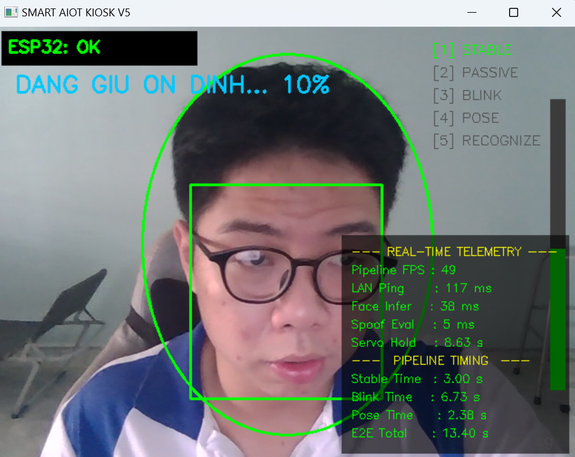

**Step 3 — BLINK:** System prompts user to blink twice. EAR (Eye Aspect Ratio) is computed from 6 MediaPipe landmarks per eye. Counter shown as `(0/2)`.

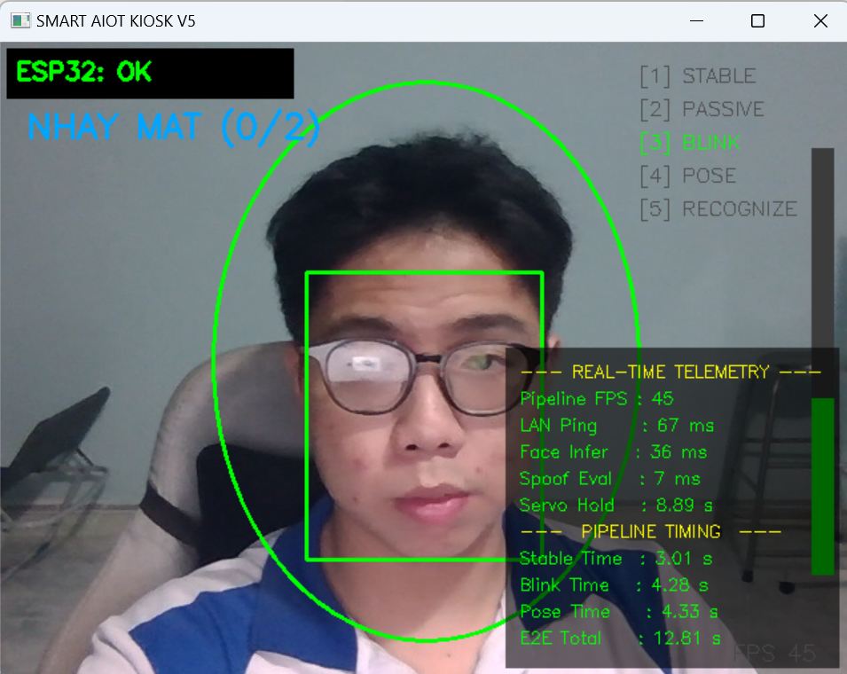

**Step 4 — POSE:** System randomly selects LEFT or RIGHT, displays a percentage hold bar. User must maintain the pose for 0.8 s.

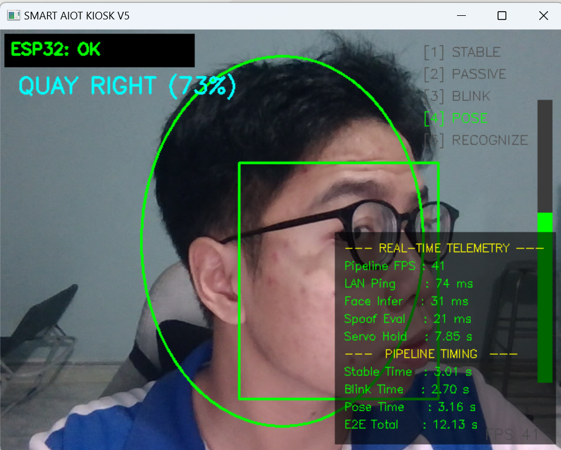

**Step 5 — Door Opens:** After all 5 steps pass, the command is sent to ESP32 via HTTP POST. Servo rotates to 90°. Screen shows `CUA DA MO` with real-time telemetry confirming E2E latency.

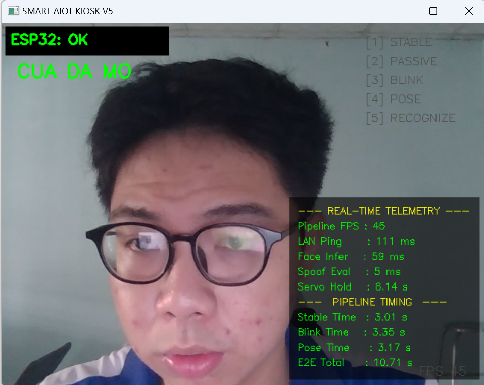

---

### 2. Face Recognition — Success

Python AI recognizes the face at **58.2% cosine similarity** (above the 0.55 threshold). The command `FACE_RECOGNIZED` is immediately HTTP-POSTed to ESP32.

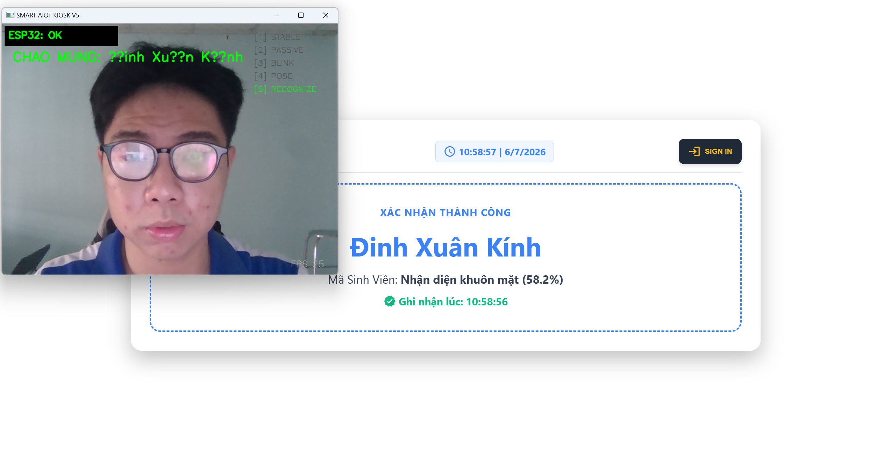

Web Admin screen updates in real time via Firebase listener — displays name, method, and timestamp:

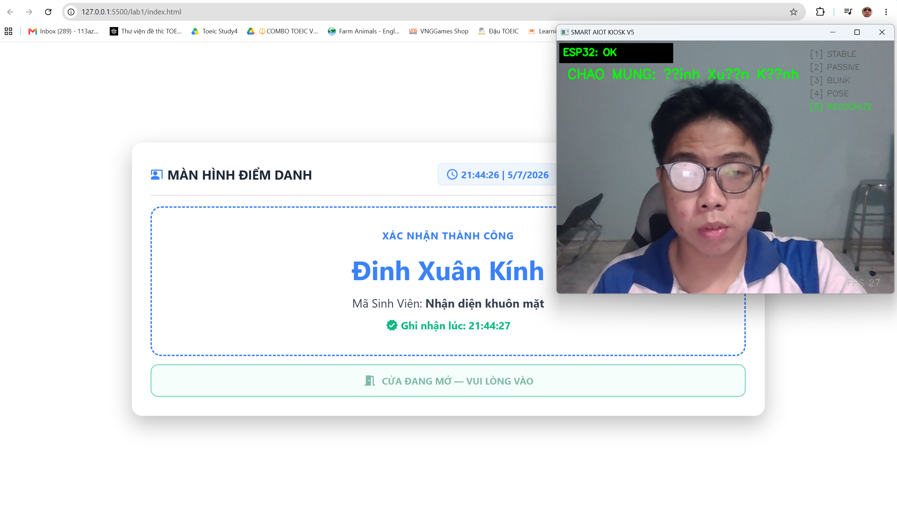

---

### 3. RFID Card — Success

RFID processing is handled **entirely on ESP32**, independent of the Python pipeline. When a registered card is scanned, the servo opens within 0.38 s and the event is logged to Firebase `DailyLogs`.

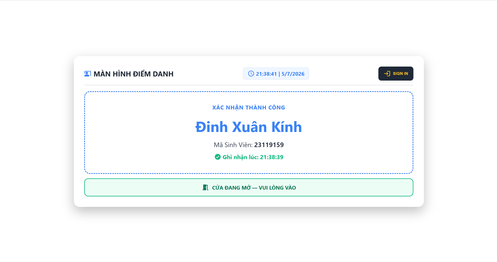

---

### 4. Security — Rejected Cases

**Unregistered RFID card:** ESP32 rejects the card locally and pushes the UID to `UnregisteredCards` on Firebase. Web Admin shows a security alert immediately.

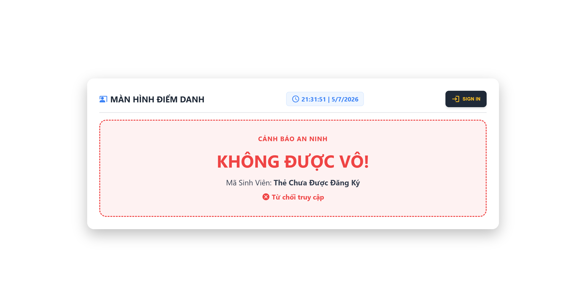

**Unknown face:** After completing STABLE → PASSIVE → BLINK → POSE, the embedding does not match any DB entry (cosine sim < 0.55). ESP32 receives `FACE_UNKNOWN` and displays angry-eye animation.

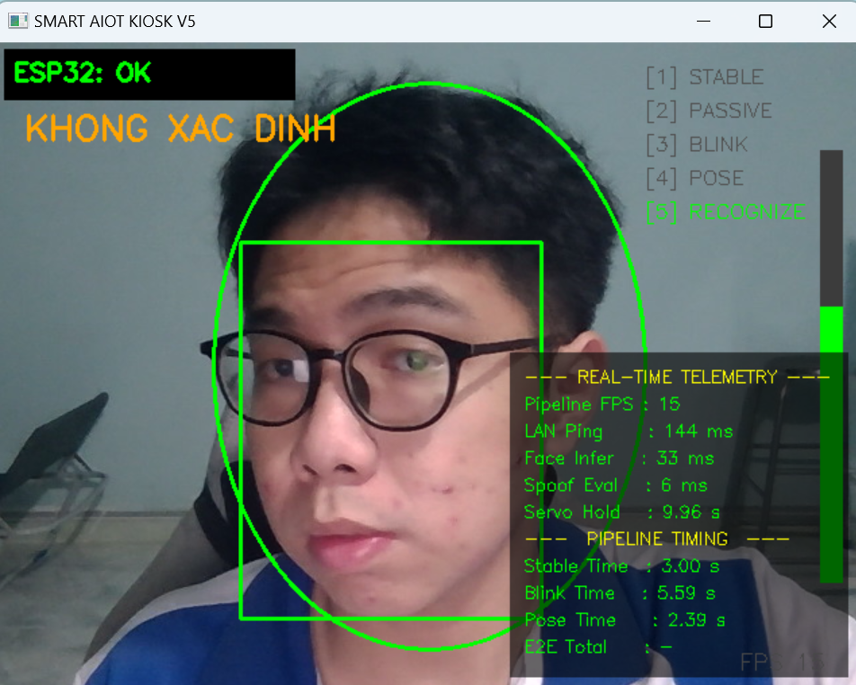

**Anti-spoofing — Printed photo & phone screen:**
- Top: Printed photo held up → **SPOOF! (0%)** at PASSIVE step. The ONNX model detects flat texture immediately.
- Bottom: Phone screen with a child's photo → passes PASSIVE (screen held at angle avoids geometry detection) but **blocked at BLINK** — the image cannot blink.

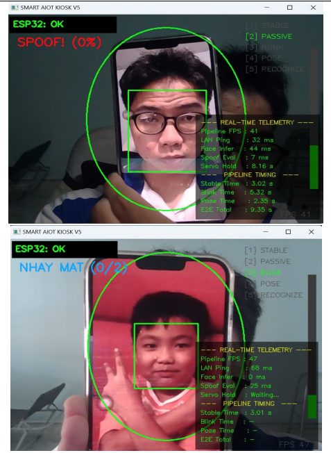

---

### 5. Web Admin Interface

**Attendance screen (idle):** Displays current time, waiting for card scan or face recognition event.

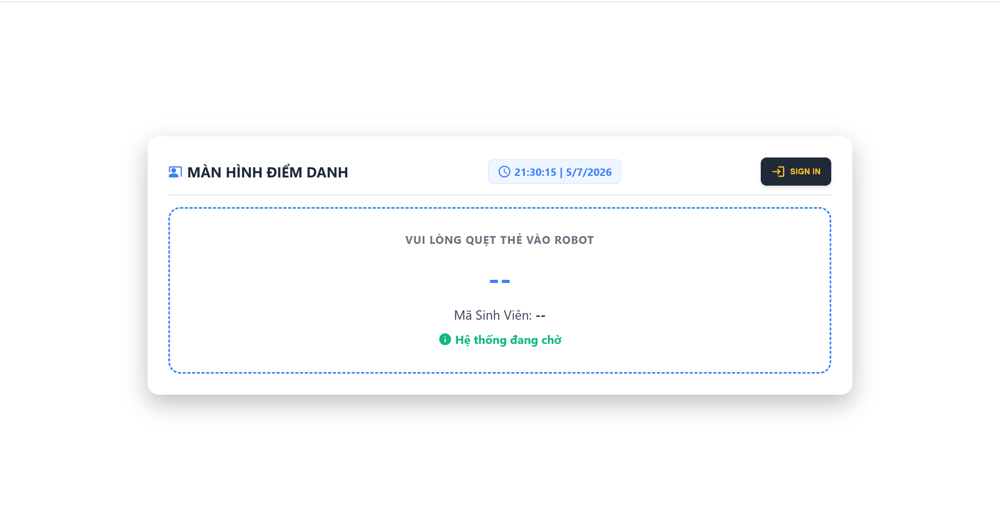

**Admin dashboard + face registration:** Admin can register a student's card and trigger face capture in one flow. The Python AI Engine starts the 3-angle registration immediately after the Web command.

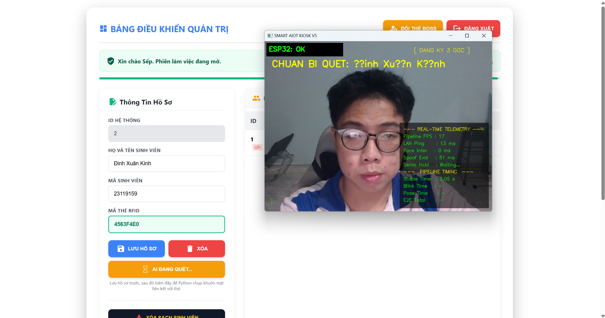

---

### 6. ESP32 Serial Telemetry

After each RFID scan, ESP32 prints a full telemetry report to Serial Monitor — uptime, heap, WiFi signal, response time, door status, queue depth, and task stack watermark.

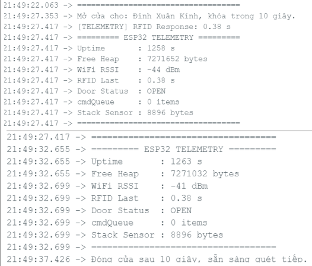

Key observations from the log:
- **No watchdog reset** after 1258 s uptime — system stable
- **Free Heap: 7,271,652 bytes** — no memory leak over 20 min
- **Stack Sensor remaining: 8,896 bytes** — well above stack overflow danger zone
- **cmdQueue: 0 items** — no command backlog, queue drains immediately
- **Door closes automatically** at exactly 10 s after open

---

## Performance Metrics

### Real-Time Telemetry (measured on test hardware)

| Metric | Value | Notes |
|--------|-------|-------|
| Pipeline FPS | **45 fps** | CPU-only, no GPU |
| LAN Ping (Python → ESP32) | **111 ms** | Same subnet, Wi-Fi |
| Face Inference (InsightFace buffalo_s) | **59 ms** | det_size 160×160 |
| AntiSpoof Eval (ONNX quantized INT8) | **5 ms** | input 128×128 |
| RFID Response Time | **0.38 s** | UID read → servo move |
| Door Hold Time | **~8–9 s** | measured servo cycle |

### End-to-End Pipeline Timing (per authentication attempt)

| Step | Time |
|------|------|
| STABLE (3 s hold) | 3.01 s |
| PASSIVE (ONNX eval) | < 0.1 s |
| BLINK (2× blink, typical) | 3.35 s |
| POSE (head turn, typical) | 3.17 s |
| RECOGNIZE (InsightFace) | 0.06 s |
| HTTP POST to ESP32 | 0.11 s |
| **E2E Total (typical)** | **~10.71 s** |

### ESP32 System Health (Serial Monitor, uptime ~20 min)

| Metric | Value |
|--------|-------|
| Uptime without reboot | 1,258 s |
| Free Heap | 7,271,652 bytes (~7 MB) |
| WiFi RSSI | −41 dBm |
| Stack Sensor remaining | 8,896 bytes |
| cmdQueue pending | 0 items |

### Test Scenarios

| Scenario | Result |
|----------|--------|
| Unregistered RFID card | ✅ Rejected — Web shows security alert |
| Registered RFID card | ✅ Door opens in 0.38 s, attendance logged |
| Valid face (registered) | ✅ Door opens, Web shows name + timestamp |
| Unknown face (unregistered) | ✅ Rejected — ESP32 shows angry eyes |
| Spoofing with printed photo | ✅ Blocked at PASSIVE (SPOOF! 0%) |
| Spoofing with phone screen (far) | ✅ Blocked at PASSIVE |
| Spoofing with phone screen (close) | ⚠️ PASSIVE bypassed — blocked at BLINK |

---

## Setup

### Python AI Engine

**Requirements:** Python 3.10 · CUDA optional (CPU-only works)

```bash
pip install opencv-python mediapipe onnxruntime insightface requests numpy
```

**Model files** — place in `smart-kiosk/models/`:
- `best_model_quantized.onnx` — AntiSpoof binary classifier (INT8 quantized)
- `face_landmarker.task` — MediaPipe FaceLandmarker
- `vectors.npz` — face embedding DB (auto-created on first registration)

**Configure** `smart-kiosk/config.py`:
```python
ESP32_IP     = "192.168.x.x"    # ESP32 LAN IP (set static in router)
FIREBASE_URL = "https://your-project-default-rtdb.firebaseio.com"
```

**Run:**
```bash
cd smart-kiosk
python main.py
# K → toggle telemetry dashboard
# Q → quit
```

### ESP32 Firmware

1. Open `esp32/Doan1/Doan1.ino` in Arduino IDE 2.x
2. Install libraries via Library Manager:
   - `ESP Async WebServer` by ESP32Async
   - `AsyncTCP` by ESP32Async
   - `Firebase_ESP_Client` by Mobizt
   - `MFRC522` · `Adafruit_ILI9341` · `ESP32-audioI2S` · `ESP32Servo` · `ArduinoJson`
3. Board settings: **ESP32S3 Dev Module** · **USB CDC On Boot → Enabled** · **Partition Scheme → Huge APP**
4. Edit credentials at top of `Doan1.ino`:
```cpp
const char* ssid     = "your_wifi";
const char* password = "your_password";
#define FIREBASE_API_KEY "your_key"
#define FIREBASE_URL     "your-project.firebaseio.com"
```
5. Hold **BOOT** → click **Upload** → release **BOOT** when `Connecting...` appears

### Web Admin

Open `web/index.html` directly in browser — no web server needed, uses Firebase JS SDK.

Default login: `admin` / `123456`

### Firebase Setup

Enable **Realtime Database** in test mode. The system auto-creates:

```
/students/          ← student profiles (name, studentId, rfid)
/DailyLogs/         ← attendance logs by date (DD-MM-YYYY)
/RobotLeTan/
  /Control          ← Web Admin → Python/ESP32 commands
  /AIEvents         ← Python → Web Admin events
  /Status           ← ESP32 door status (DOOR_OPEN / READY)
/admin/             ← admin existence flag
```

---

## Project Structure

```
esp32-face-recognition-lock/
├── smart-kiosk/                  # Python AI Engine
│   ├── main.py                   # Entry point
│   ├── config.py                 # All thresholds, IPs, paths
│   ├── core/
│   │   ├── kiosk.py              # Main loop & 5-step pipeline orchestrator
│   │   ├── recognition.py        # AntiSpoofWorker + FaceRecognizer
│   │   └── registration.py       # Multi-angle face registration (3 poses)
│   ├── bridges/
│   │   ├── esp32_bridge.py       # Async HTTP POST to ESP32
│   │   └── firebase_bridge.py    # Firebase poll + background log writer
│   ├── vision/
│   │   ├── camera.py             # Threaded camera reader (no frame lag)
│   │   └── cv_utils.py           # EAR, head pose, blur check, smooth box
│   ├── ui/
│   │   └── overlay.py            # OpenCV HUD: telemetry, oval guide, steps
│   └── models/                   # Place model files here (not committed)
├── esp32/
│   └── Doan1/
│       └── Doan1.ino             # ESP32-S3 firmware (3 FreeRTOS tasks)
├── web/
│   ├── index.html                # Single-page Web Admin
│   ├── function.js               # Firebase listeners + admin logic
│   └── style.css
├── docs/                         # Screenshots used in this README
└── README.md
```

---

## Limitations

| Issue | Detail | Mitigation path |
|-------|--------|-----------------|
| **Video replay attack** | A pre-recorded video with blink + head-turn can defeat the pipeline | Depth estimation (Intel RealSense) or Moiré pattern analysis |
| **Screen detection geometry-dependent** | `detect_screen()` fails when phone is held very close (frame exits ROI) | Texture-based screen detection (FFT frequency analysis) |
| **Single person per frame** | `num_faces=1` — multi-person scenarios not handled | Increase to `num_faces=N`, assign pipeline per track |
| **Face DB stored locally** | `vectors.npz` flat file on Python host — not cloud-synced | Redis or SQLite backend with REST sync |
| **No physical enclosure** | Breadboard prototype — not weatherproof | Custom PCB + ABS enclosure for deployment |
| **TTS depends on Google** | `audio.connecttospeech()` requires Internet | Local TTS via edge model (e.g., piper-tts) |

---

## License

MIT — see [LICENSE](LICENSE)
